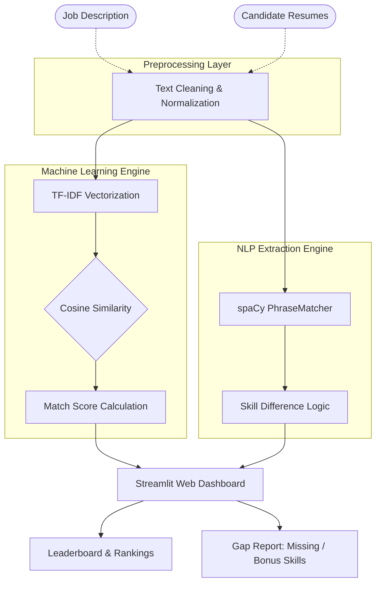

<div align="center">
  <h1>🎯 Resume Skill Gap Analyzer</h1>
  <p><i>An AI-Powered NLP tool to instantly screen resumes against Job Descriptions, calculate Match Scores, and identify Skill Gaps.</i></p>

  <!-- Badges -->
  <p>
    
    
    
    
    
  </p>
    
  <h3>
    🔴 <a href="https://resume-skill-gap-analyzer-aw4hhwud7zwdzynwewuotq.streamlit.app/" target="_blank">View Live Application</a>
  </h3>
</div>

---

## 📖 Overview

The **Resume Skill Gap Analyzer** is a robust Machine Learning application designed to automate the initial phase of recruitment. It parses a Job Description (JD) and a batch of resumes (PDF or TXT) to evaluate how closely candidates match the required profile. 

Instead of simple keyword matching, this tool uses **Term Frequency-Inverse Document Frequency (TF-IDF)** and **Cosine Similarity** to calculate an intelligent match score. It also utilizes **spaCy NLP** for precise entity extraction to generate a tangible **Skill Gap Report**.

---

## 🏗️ System Architecture & Flowchart

Below is the complete workflow of how the Machine Learning and NLP models process the data from raw text to the final report.



### 🧠 How the Engine Works (Step-by-Step)
1. **Text Normalization**: Raw text from PDFs is converted to lowercase, special characters are removed, but critical IT skill terms (like `C++`, `Node.js`) are preserved.
2. **TF-IDF Vectorization**: Transforms the text documents into numerical vectors. It assigns higher mathematical weights to rare, important skill keywords and lower weights to common filler words.
3. **Cosine Similarity**: Calculates the cosine angle between the Job Description vector and the Resume vector. A closer angle yields a higher similarity score percentage.
4. **spaCy (NLP) Extraction**: Uses `en_core_web_sm` and a custom `PhraseMatcher` to explicitly locate technical skills within the text, allowing us to accurately map exactly which skills the candidate possesses and lacks.

---

## 📂 Project Structure

```text
resume-skill-gap-analyzer/
│
├── app.py                 # Streamlit UI & Application Entry Point
├── analyzer.py            # Core ML Logic (TF-IDF, Cosine Sim, Scoring)
├── skill_extractor.py     # NLP Module (spaCy PhraseMatcher)
├── requirements.txt       # Project Dependencies
└── README.md              # Project Documentation
```

---

## 🚀 How To Run (Detailed Instructions)

You can run this project either natively on your computer or instantly via Google Colab.

### Option 1: Run Locally on your Machine

**Prerequisites**: Ensure you have Python 3.9+ installed on your system.

1. **Clone the repository**:
   Open your terminal and run:
   ```bash
   git clone https://github.com/YOUR_USERNAME/resume-skill-gap-analyzer.git
   cd resume-skill-gap-analyzer
   ```

2. **Install all Dependencies**:
   Install the required ML and UI libraries:
   ```bash
   pip install -r requirements.txt
   ```

3. **Download spaCy NLP Model**:
   This downloads the English core vocabulary required for skill extraction:
   ```bash
   python -m spacy download en_core_web_sm
   ```

4. **Launch the Application**:
   Start the Streamlit local server:
   ```bash
   streamlit run app.py
   ```
   *The application will automatically open in your web browser at `http://localhost:8501`.*

---

### Option 2: Run via Google Colab (Cloud Setup)

If you want to run the project without installing anything on your machine, you can host the Streamlit app on Google Colab using `localtunnel`.

1. Open a new [Google Colab Notebook](https://colab.research.google.com/).
2. Run the following cells sequentially:

**Cell 1: Setup Environment**
```python
!pip install -q streamlit pandas numpy scikit-learn spacy PyPDF2
!python -m spacy download en_core_web_sm
```

**Cell 2: Fetch the Code**
```python
# Clone the Github Repo into the colab session
!git clone https://github.com/YOUR_USERNAME/resume-skill-gap-analyzer.git
%cd resume-skill-gap-analyzer
```

**Cell 3: Start Streamlit & Create Tunnel**
```python
!npm install localtunnel
import urllib

# 1. Fetch and print the Endpoint IP (You will need this as the password)
endpoint_ip = urllib.request.urlopen('https://ipv4.icanhazip.com').read().decode('utf8').strip("\n")
print("👉 Your Endpoint IP (Password) for LocalTunnel is:", endpoint_ip)

# 2. Run Streamlit in the background and expose it via LocalTunnel
!streamlit run app.py & npx localtunnel --port 8501
```
*(Once Cell 3 executes, it will print a link that looks like `https://....loca.lt`. Click it, paste the **Endpoint IP** printed in the cell output, and access the UI!)*

---

## 📊 Features & Output Report

- **Leaderboard Rankings**: Ranks all uploaded resumes in a dynamic dataframe based on their `Match Percentage`.
- **Intelligent Categorization**: Automatically flags candidates based on thresholds as `🏆 Excellent`, `✅ Good`, `⚠️ Fair`, or `❌ Poor`.
- **Detailed Gap Analysis UI**:
  - **✅ Matched Skills**: The exact technical skills present in BOTH the JD and the Resume.
  - **❌ Missing Skills**: Skills strictly required by the JD but entirely missing from the candidate's resume.
  - **🌟 Bonus Skills**: Additional tech skills the candidate possesses that weren't even asked for in the Job Description.

---

## 🤝 Contributing & Support

Contributions, issues, and feature requests are highly welcome! Feel free to check the issues page if you want to contribute to the code.

## 📝 License

This project is open-sourced under the **MIT** license.
